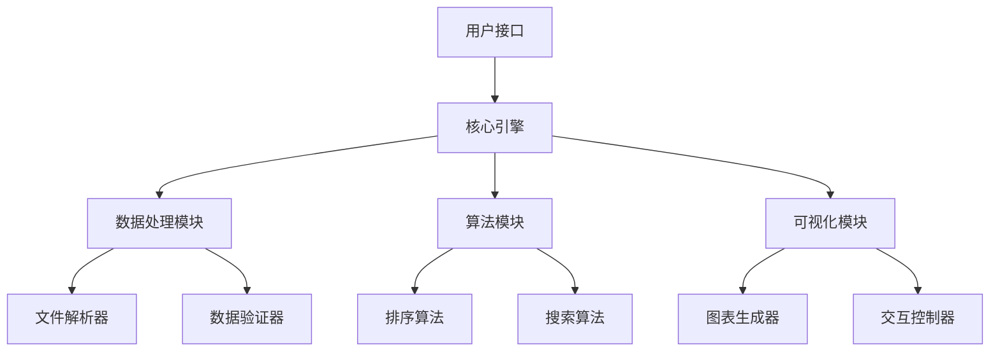

# 项目文档

欢迎来到我们的项目文档！这里包含了完整的使用指南、API 参考和最佳实践。

## 快速开始

### 安装

```bash
# 使用 pip 安装
pip install our-project

# 或者从源码安装
git clone https://github.com/our-org/our-project.git
cd our-project
pip install -e .
```

### 基本使用

```python
from our_project import Project

# 创建项目实例
project = Project()

# 执行基本操作
result = project.process("Hello, World!")
print(result)
```

## 主要功能

### 1. 数据处理

我们的项目提供了强大的数据处理功能，支持多种数据格式：

- **CSV 文件**：自动解析和验证
- **JSON 数据**：智能类型推断
- **XML 文档**：结构化处理
- **数据库连接**：支持多种数据库

### 2. 算法实现

内置了多种常用算法：

- **排序算法**：快速排序、归并排序、堆排序
- **搜索算法**：二分搜索、线性搜索
- **图算法**：最短路径、最小生成树
- **机器学习**：分类、回归、聚类

### 3. 可视化支持

提供丰富的可视化功能：

- **图表绘制**：线图、柱状图、散点图
- **3D 可视化**：立体图形、表面图
- **交互式图表**：支持缩放、平移、选择
- **导出功能**：PNG、SVG、PDF 格式

## 架构设计

### 核心组件



### 设计原则

1. **模块化设计**：每个组件都是独立的，可以单独使用
2. **可扩展性**：支持插件机制，可以轻松添加新功能
3. **高性能**：优化的算法实现，支持大规模数据处理
4. **易用性**：简洁的 API 设计，丰富的文档和示例

## 性能指标

### 基准测试结果

| 算法 | 数据规模 | 执行时间 | 内存使用 |
|------|----------|----------|----------|
| 快速排序 | 10,000 项 | 2.3ms | 1.2MB |
| 归并排序 | 10,000 项 | 3.1ms | 2.1MB |
| 二分搜索 | 100,000 项 | 0.1ms | 0.5MB |
| 图遍历 | 1,000 节点 | 15.2ms | 3.8MB |

### 优化建议

- **内存优化**：使用生成器而不是列表来减少内存占用
- **并行处理**：利用多核 CPU 进行并行计算
- **缓存机制**：缓存计算结果以提高性能
- **算法选择**：根据数据特征选择最适合的算法

## 常见问题

### Q: 如何处理大型数据集？

A: 我们提供了多种处理大型数据集的方法：

1. **分块处理**：将数据分成小块逐步处理
2. **流式处理**：边读边处理，不占用大量内存
3. **并行处理**：利用多进程或多线程加速
4. **数据库集成**：直接处理数据库中的数据

### Q: 支持哪些数据格式？

A: 目前支持以下格式：

- CSV（逗号分隔值）
- JSON（JavaScript 对象表示法）
- XML（可扩展标记语言）
- Excel（.xlsx 文件）
- Parquet（列式存储格式）
- HDF5（层次数据格式）

### Q: 如何自定义算法？

A: 可以通过以下方式自定义算法：

1. **继承基类**：继承 `Algorithm` 基类并实现必要方法
2. **插件机制**：将算法打包为插件并动态加载
3. **配置参数**：通过配置文件调整算法参数
4. **回调函数**：提供回调函数来监控算法执行过程

## 贡献指南

我们欢迎社区贡献！请查看 [贡献指南](CONTRIBUTING.md) 了解如何参与项目开发。

### 开发环境设置

```bash
# 克隆仓库
git clone https://github.com/our-org/our-project.git
cd our-project

# 创建虚拟环境
python -m venv venv
source venv/bin/activate  # Linux/Mac
# 或
venv\Scripts\activate  # Windows

# 安装开发依赖
pip install -r requirements-dev.txt

# 运行测试
pytest tests/

# 构建文档
mkdocs serve
```

### 代码规范

- 使用 Black 进行代码格式化
- 使用 flake8 进行代码检查
- 使用 mypy 进行类型检查
- 编写单元测试和集成测试
- 更新文档和示例

## 许可证

本项目采用 MIT 许可证。详情请查看 [LICENSE](LICENSE) 文件。

## 联系方式

- **项目主页**：https://github.com/our-org/our-project
- **问题反馈**：https://github.com/our-org/our-project/issues
- **讨论区**：https://github.com/our-org/our-project/discussions
- **邮箱**：contact@our-org.com

---

*最后更新：2024年1月*


